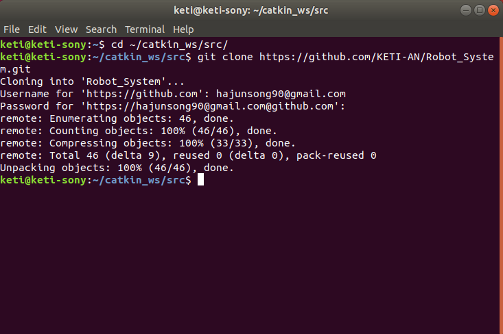
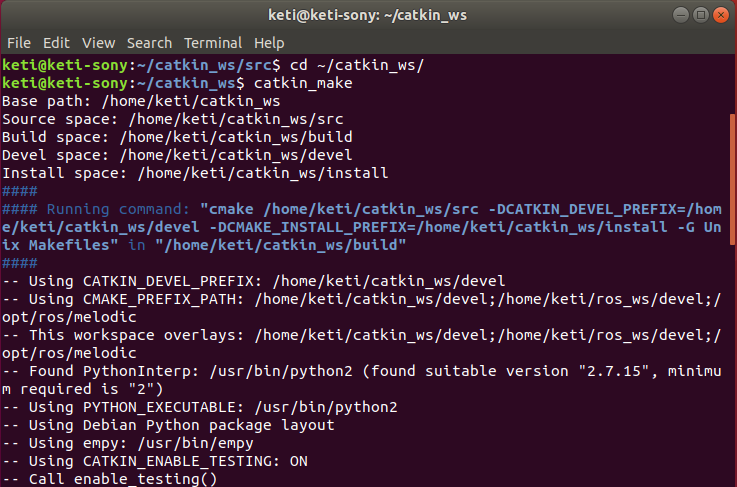
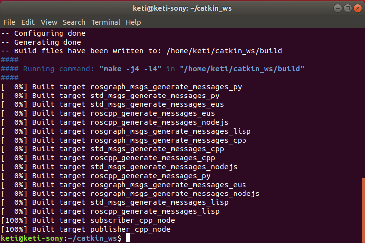
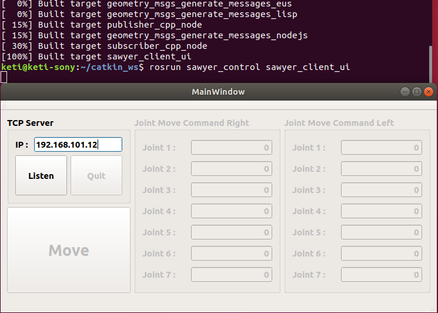
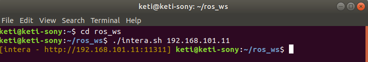
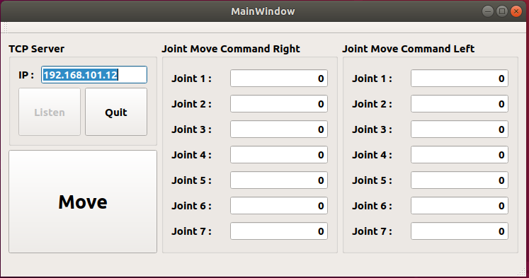
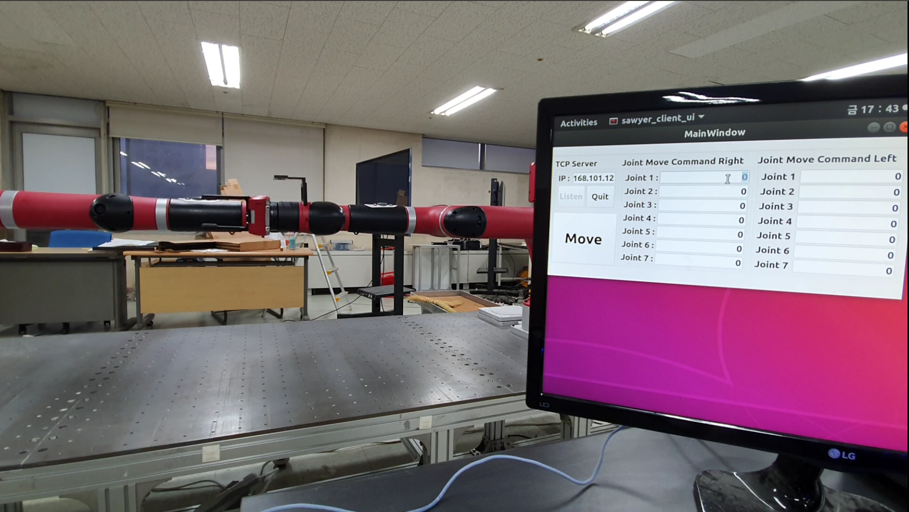
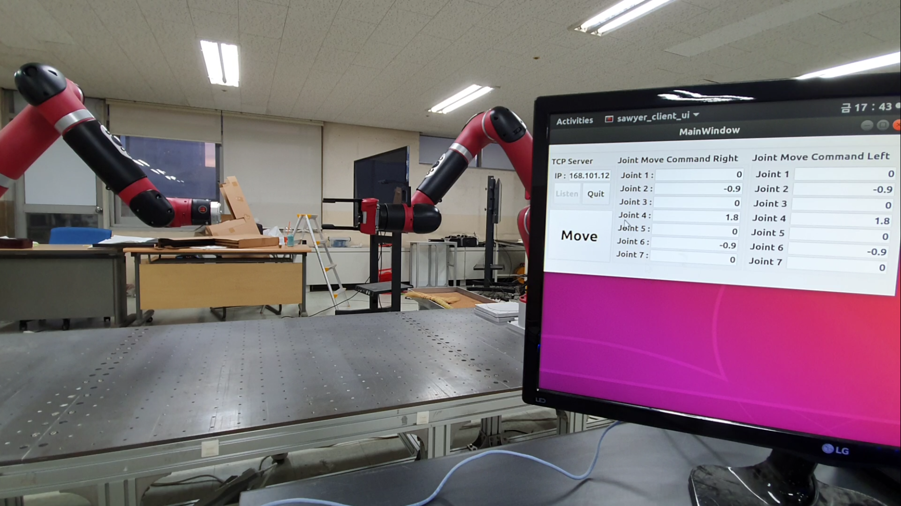

### 1. ~/catkin_ws/src 로 이동해서 github 에서 프로젝트 다운로드
~~~
cd ~/catkin_ws/src
git clone git clone https://github.com/KETI-AN/Robot_System.git
~~~

### 2. ~/catkin_ws 위치에서 catkin_make 로 빌드
~~~
cd ~/catkin_ws/src
catkin_make
~~~

### 3. sawyer client ui node 실행
~~~
rosrun sawyer_control sawyer_client_ui
~~~

### 4. 현재 PC의 IP 주소 입력 후 Listen 클릭
### 5. 터미널 실행 후 ~/ros_ws 폴더로 이동 후 sawyer 로봇 팔에 접속
~~~
cd ~/ros_ws
./intera.sh sawyer_IP_address
~~~

### 6. sawyer client 실행
- 이 때 XX 는 앞서 입력한 sawyer_IP_address의 끝 번호 입력
~~~
source ~/catkin_ws/devel/setup.bash
rosrun sawyer_control sawyer_client.py XX
~~~

### 7. 5 ~ 6 을 반복하여 또다른 sawyer 로봇 팔에 접속
- sawyer client 실행 시 ui와 바로 연결 되므로 ip address 10 부터 시행하고 그 다음 11을 실행한다.

### 8. 두 개의 sawyer에 정상적으로 접속되면 ui에서 비활성화 

### 9. Joint 1 ~ 7 에 원하는 값을 입력하고 Move 버튼을 누르면 입력 된 값에 따라서 두 sawyer 로봇 팔이 움직인다.

### 10. source code manual
~~~ cpp
void MainWindow::btnMoveClicked(){
    double txDataDoubleRight[7] = {0.0,};
    double txDataDoubleLeft[7] = {0.0,};

    for(int i = 0; i < 7; i++){
        txDataDoubleRight[i] = jointCommandRight[i]->text().toDouble();
        txDataDoubleLeft[i] = jointCommandLeft[i]->text().toDouble();
    }

    QByteArray txDataRight, txDataLeft;

    txDataRight.append(Qt::Key_S);
    txDataRight.append(Qt::Key_M);
    for(uint i = 0; i < 7; i++){
        txDataRight.append(QByteArray::number(txDataDoubleRight[i], 'f', 6));
        txDataRight.append(',');
    }
    txDataRight.append(Qt::Key_S);
    txDataRight.append(Qt::Key_E);

    txDataLeft.append(Qt::Key_S);
    txDataLeft.append(Qt::Key_M);
    for(uint i = 0; i < 7; i++){
        txDataLeft.append(QByteArray::number(txDataDoubleLeft[i], 'f', 6));
        txDataLeft.append(',');
    }
    txDataLeft.append(Qt::Key_S);
    txDataLeft.append(Qt::Key_E);

    tcpServer->socket[0]->write(txDataRight);
    tcpServer->socket[1]->write(txDataLeft);
    qDebug() << "txData(To Right) : " << txDataRight;
    qDebug() << "txData(To Left) : " << txDataLeft;
}
~~~
- ui 에서 Joint 1 ~ 7 에 입력 된 각도 값을 bytearray 에 순서대로 담아 client 로 전송한다.

~~~ python
center_str = received.split('SM')[1].split('SE')[0]
print(center_str)

center_str_split = center_str.split(',')

goal_joint_angles[0] = Decimal(center_str_split[0])
goal_joint_angles[1] = Decimal(center_str_split[1])
goal_joint_angles[2] = Decimal(center_str_split[2])
goal_joint_angles[3] = Decimal(center_str_split[3])
goal_joint_angles[4] = Decimal(center_str_split[4])
goal_joint_angles[5] = Decimal(center_str_split[5])
goal_joint_angles[6] = Decimal(center_str_split[6])

traj = MotionTrajectory(limb = limb)

waypoint = MotionWaypoint(options = wpt_opts.to_msg(), limb = limb)

joint_angles = limb.joint_ordered_angles()

waypoint.set_joint_angles(joint_angles = joint_angles)
traj.append_waypoint(waypoint.to_msg())

waypoint.set_joint_angles(joint_angles = goal_joint_angles)
traj.append_waypoint(waypoint.to_msg())

result = traj.send_trajectory(timeout=0.2)
~~~
- ui 로 부터 전송 된 데이터에서 header 와 trailer 를 확인하고 그 사이의 데이터를 "," 단위로 분리하고  
각 조인트 값을 goal_joint_angles 배열에 순차적으로 입력한다.
- 위 source code는 sawyer 로봇에 joint waypoint를 설정해서 구동하는 방법을 사용한다.
- waypoint의 첫번째는 현재 로봇의 joint angle이 되고 두번째는 입력한 joint angle이 된다.